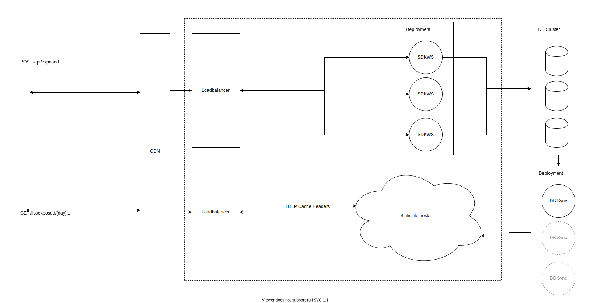

# NoiApp-Backend


## Discussion and chat

While daily chat is on slack, the discussion on core topics like architecture is on google groups.

Slack: [](https://noiapp.slack.com/)

Google: [](https://groups.google.com/forum/#!forum/noiapp)

This is a fork of [https://github.com/DP-3T/dp3t-sdk-backend.git](https://github.com/DP-3T/dp3t-sdk-backend.git) for the [NoiApp](https://github.com/noiapp/noiapp)

## DP3T
The Decentralised Privacy-Preserving Proximity Tracing (DP-3T) project is an open protocol for COVID-19 proximity tracing using Bluetooth Low Energy functionality on mobile devices that ensures personal data and computation stays entirely on an individual's phone. It was produced by a core team of over 25 scientists and academic researchers from across Europe. It has also been scrutinized and improved by the wider community.

DP-3T is a free-standing effort started at EPFL and ETHZ that produced this protocol and that is implementing it in an open-sourced app and server.


## Introduction
This is the first implementation of the DP-3T "low bandwidth" protocol. The current implementation does not use the as yet unreleased "Contact Tracing" API of Apple/Google--**and has limitations as a result**. Our "hybrid approach" uses Bluetooth Low Energy (BLE) to exchange `EphID`s. It uses advertisements whenever possible and falls back to GATT Server connections if not possible to transmit/collect an `EphID` this way (e.g., on iOS devices when the app is in background). This approach can result in higher energy consumption and scalability issues and will be replaced by the Apple/Google API.

Our immediate roadmap is: to support the Apple/Google wire protocol, to be forward-compatible, and to support the actual Apple/Google API as soon as it is released to iOS and Android devices.

## Repositories
* Android SDK & Calibration app: [dp3t-sdk-android](https://github.com/DP-3T/dp3t-sdk-android)
* iOS SDK & Calibration app: [dp3t-sdk-ios](https://github.com/DP-3T/dp3t-sdk-ios)
* Android Demo App: [dp3t-app-android](https://github.com/DP-3T/dp3t-app-android)
* iOS Demo App: [dp3t-app-ios](https://github.com/DP-3T/dp3t-app-ios)
* Backend SDK: [dp3t-sdk-backend](https://github.com/DP-3T/dp3t-sdk-backend)

## Work in Progress
The DP3T-Backend-SDK contains alpha-quality code only and is not yet complete. It has not yet been reviewed or audited for security and compatibility. We are both continuing the development and have started a security review. This project is truly open-source and we welcome any feedback on the code regarding both the implementation and security aspects.
This repository contains the open prototype SDK, so please focus your feedback for this repository on implementation issues.

## Further Documentation
The full set of documents for DP3T is at https://github.com/DP-3T/documents. Please refer to the technical documents and whitepapers for a description of the implementation.

## Architecture
A central discovery service is hosted on [Github](https://github.com/DP-3T/dp3t-discovery). This server provides the necessary information for the SDK to initialize itself. After the SDK loads the base url for its own backend, it will load the infected list from there, as well as post if a user is infected. This will also allow apps to fetch lists from other backend systems participating in this scheme and can handle roaming of users.

The SDK-Backend provides an interface to publish exposed keys and get a list of exposed keys.

> Note that the requests on the image are not the actual endpoints in the reference implementation. They differ in the picture to show the possible separation of the two requests. For the actual enpoint paths refer to the backend documentation further down (e.g. PDF or OpenAPI).



### General
This repository contains a backend implementation (webservice) written with Spring Boot, that implements the specification of the Decentralized Privacy-Preserving Proximity Tracing system.


### Dependencies
* Spring Boot 2.2.6
* Java 8 (or higher)
* Logback
* [Springboot-Swagger-3](https://github.com/Ubique-OSS/springboot-swagger3) (Github Package)
* [Springboot-Swagger-3-Annotations](https://github.com/Ubique-OSS/springboot-swagger3-annotations) (Github Package)

### Database
For development purposes an hsqldb can be used to run the webservice locally. For production systems we recommend connecting to a PostgreSQL dabatase (cluster if possible). The simple database schema is described in the following diagram:


### API
The backend API specification is documented here:
* [PDF](/documentation/documentation.pdf)
* [Swagger Editor](https://editor.swagger.io/?url=https://raw.githubusercontent.com/DP-3T/dp3t-sdk-backend/develop/documentation/yaml/sdk.yaml)

### Build
To build you need to install Maven.

```bash
cd dpppt-backend-sdk
mvn install
```
### Run
```bash
java -jar dpppt-backend-sdk-ws/target/dpppt-backend-sdk-ws-*.jar
```
### Dockerfiles
The dockerfile includes a base jdk image to run the jar. To actually build the docker container, you need to place the generated jar in the bin folder.

```bash
cd ..
cp dpppt-backend-sdk/dpppt-backend-sdk-ws/target/dpppt-backend-sdk-ws-1.0.0-SNAPSHOT.jar ws-sdk/ws/bin/dpppt-backend-sdk-ws-1.0.0
```

```bash
cd ws-sdk && docker build -t noiapp/noiapp-backend:develop .
```

For development using an in-memory H2 database you can run:

```bash
docker run -p 80:8080 -e JAVA_OPTS="-Dspring.profiles.active=dev" noiapp/noiapp-backend:develop
 ```

### Makefile
You can use the provided makefile to build the backend, build a docker image and generate the documentation.

Without a target the makefile will generate everything except the docker image.

```bash
make
``` 

To build the docker image run

```bash
make docker-build
```

### Test hello messge

```
curl -XGET http://localhost/v1
```

## License
This project is licensed under the terms of the MPL 2 license. See the [LICENSE](LICENSE) file.
